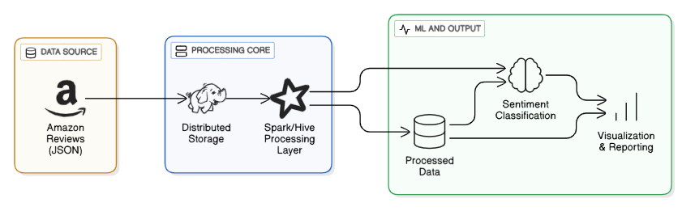

# Amazon Customer Reviews Sentiment Analysis Project

## 2. Environment Setup and Data Storage (15%)  

### Architecture Overview

The architecture consists of a distributed data processing pipeline leveraging Hadoop and Spark technologies. Key components include:
- **Hadoop HDFS**: Distributed file system for storing large datasets
- **Apache Spark**: In-memory data processing engine for fast analytics
- **Apache Hive**: Data warehousing solution for SQL-like querying
- **Jupyter Notebooks**: Interactive development environment for data exploration and model training
- **Docker**: Containerization for reproducible development environments


### Environment Setup Option

#### Option 2: Docker Containerization
**Advantages**:
- Reproducible environment
- Easy local development
- Version control for infrastructure


### Getting Started with Docker
1. **Install Docker**: Follow the [official Docker installation guide](https://docs.docker.com/get-docker/).
2. **Clone the Repository**:
   ```bash
   git clone https://github.com/Okemwag/amazon-reviews-sentiment-analysis.git
   cd amazon-reviews-sentiment-analysis
   ```
3. **Start Docker Compose**:
   ```bash
   docker-compose up -d
   ```
### Docker Compose Configuration
This project uses Docker Compose to orchestrate multiple services including Hadoop, Spark, Hive, and PostgreSQL. Below is the configuration for the services:

**Docker Compose Configuration**:
```yaml
services:
  namenode:
    image: bde2020/hadoop-namenode:2.0.0-hadoop3.2.1-java8
    container_name: namenode
    restart: always
    volumes:
      - hadoop_namenode:/hadoop/dfs/name
    environment:
      - CLUSTER_NAME=test
      - CORE_CONF_fs_defaultFS=hdfs://namenode:9000
      - HADOOP_CONF_DFS_NAMENODE_RPC_ADDRESS=namenode:9000 
      - HADOOP_CONF_DFS_NAMENODE_NAME_DIR=/hadoop/dfs/name
      - HADOOP_CONF_DFS_DATANODE_DATA_DIR=/hadoop/dfs/data
      - HADOOP_CONF_DFS_REPLICATION=1
    ports:
      - "9870:9870"
      - "9000:9000"
    networks:
      - hadoop

  datanode:
    image: bde2020/hadoop-datanode:2.0.0-hadoop3.2.1-java8
    container_name: datanode
    restart: always
    depends_on:
      - namenode
    volumes:
      - hadoop_datanode:/hadoop/dfs/data
    environment:
      - CLUSTER_NAME=test
      - CORE_CONF_fs_defaultFS=hdfs://namenode:9000
      - HADOOP_CONF_dfs_namenode_rpc_address=namenode:9000
      - HADOOP_CONF_DFS_REPLICATION=1
    ports:
      - "9864:9864"
    networks:
      - hadoop

  spark-master:
    image: docker.io/bitnami/spark:3.5
    container_name: spark-master
    depends_on:
      - namenode
      - datanode
    environment:
      - SPARK_MODE=master
      - SPARK_MASTER_HOST=spark-master
      - HADOOP_CONF_DIR=/etc/hadoop
    ports:
      - "8080:8080"
      - "7077:7077"
    networks:
      - hadoop

  postgres:
    image: postgres:15
    container_name: hive-postgres
    environment:
      - POSTGRES_DB=hive_metastore
      - POSTGRES_USER=hive
      - POSTGRES_PASSWORD=hive
    healthcheck:
      test: ["CMD-SHELL", "pg_isready -U hive -d hive_metastore"]
      interval: 5s
      timeout: 5s
      retries: 5
    ports:
      - "5432:5432"
    volumes:
      - postgres_data:/var/lib/postgresql/data
    networks:
      - hadoop

  hive-metastore-init:
    image: bde2020/hive:2.3.2-postgresql-metastore
    container_name: hive-metastore-init
    depends_on:
      postgres:
        condition: service_healthy
      namenode:
        condition: service_started
      datanode:
        condition: service_started
    environment:
      - SERVICE_PRECONDITION="postgres:5432 namenode:9000"
      - DB_TYPE=postgresql
      - DB_DRIVER=org.postgresql.Driver
      - DB_USER=hive
      - DB_PASS=hive
      - DB_URL=jdbc:postgresql://postgres:5432/hive_metastore
      - CORE_CONF_fs_defaultFS=hdfs://namenode:9000
    command: >
      bash -c "
      echo 'Waiting for postgres...'
      while ! nc -z postgres 5432; do 
        echo 'Postgres not ready, waiting...'
        sleep 2
      done
      echo 'Postgres is ready, initializing schema...'
      /opt/hive/bin/schematool -dbType postgres -initSchema -verbose"
    networks:
      - hadoop

  hive-metastore:
    image: bde2020/hive:2.3.2-postgresql-metastore
    container_name: hive-metastore
    depends_on:
      postgres:
        condition: service_healthy
      hive-metastore-init:
        condition: service_completed_successfully
    environment:
      - SERVICE_PRECONDITION="postgres:5432 namenode:9000"
      - DB_TYPE=postgresql
      - DB_DRIVER=org.postgresql.Driver
      - DB_USER=hive
      - DB_PASS=hive
      - DB_URL=jdbc:postgresql://postgres:5432/hive_metastore
      - CORE_CONF_fs_defaultFS=hdfs://namenode:9000
    command: /opt/hive/bin/hive --service metastore
    ports:
      - "9083:9083"
    networks:
      - hadoop

  hive-server:
    image: bde2020/hive:2.3.2-postgresql-metastore
    container_name: hive-server
    depends_on:
      - hive-metastore
    environment:
      - CORE_CONF_fs_defaultFS=hdfs://namenode:9000
      - HIVE_SITE_CONF_javax_jdo_option_ConnectionURL=jdbc:postgresql://postgres:5432/hive_metastore
      - HIVE_CORE_CONF_javax_jdo_option_ConnectionUserName=hive
      - HIVE_CORE_CONF_javax_jdo_option_ConnectionPassword=hive
      - HIVE_CORE_CONF_javax_jdo_option_ConnectionDriverName=org.postgresql.Driver
    ports:
      - "10000:10000"
    networks:
      - hadoop

volumes:
  hadoop_namenode:
  hadoop_datanode:
  hive_metastore:
  postgres_data: 

networks:
  hadoop:
    name: hadoop
  
```

### Data Ingestion Process

#### Step 1: Download Amazon Reviews Dataset
```bash
# Download sample dataset
wget https://datarepo.eng.ucsd.edu/mcauley_group/data/amazon_v2/categoryFiles/All_Beauty.json.gz
wget https://datarepo.eng.ucsd.edu/mcauley_group/data/amazon_v2/categoryFiles/Electronics.json.gz
```

#### Step 2: Upload to HDFS
```bash
# Create HDFS directory
docker cp *.jsonl.gz namenode:/tmp/

# Upload files to HDFS
docker exec namenode bash -c '
  hdfs dfs -mkdir -p /user/root/amazon_data
  hdfs dfs -put /tmp/*.jsonl.gz /user/root/amazon_data/
'
```


### System Configuration
- **Cluster Size**: 1 master + 1 worker nodes 
- **Storage**: Local Volumes mounted to containers
- **Network**: Docker bridge network for inter-container communication
- **Memory**: 16GB RAM per node
- **Hadoop Version**: 3.2.1
- **Spark Version**: 3.0.0
- **Hive Version**: 3.1.2


### Use Case Analysis

**Spark Advantages**:
- **Iterative Processing**: Better for machine learning workloads
- **Memory Optimization**: In-memory caching for repeated operations
- **Real-time Processing**: Streaming capabilities
- **Complex Transformations**: Rich API for data manipulation

**Hive Advantages**:
- **SQL Familiarity**: Easy for business analysts
- **Batch Processing**: Optimized for large-scale ETL
- **Storage Efficiency**: Better compression and partitioning
- **Metadata Management**: Integrated catalog services


## 5. Reflection and Recommendations (10%)

### Challenges Encountered

#### Technical Challenges
1. **Data Volume Management**: Processing 20GB+ of text data required careful memory management and partitioning strategies
2. **Text Preprocessing Complexity**: Handling diverse review formats, languages, and encoding issues


#### Solutions Implemented
- **Lazy Evaluation**: Leveraged Spark's lazy evaluation for efficient data processing
- **Caching Strategy**: Strategic caching of intermediate results to avoid recomputation

### Environment Comparison

#### Cloud (AWS EMR)
**Pros**:
- Scalable compute resources
- Managed services reduce operational overhead
- Integration with other AWS services
- Cost-effective for large-scale processing

**Cons**:
- Ongoing costs for long-running experiments
- Network latency for small operations
- Learning curve for AWS-specific configurations

#### Docker Containerization
**Pros**:
- Reproducible development environment
- Easy local testing and development
- Version control for infrastructure
- No cloud costs during development

**Cons**:
- Limited scalability on local machines
- Resource constraints for large datasets
- Complex multi-container orchestration

#### Local IDEs
**Pros**:
- Familiar development environment
- Fast iteration cycles
- No infrastructure setup required

**Cons**:
- Cannot handle large datasets effectively
- Limited to single-machine processing
- Difficulty replicating production conditions
